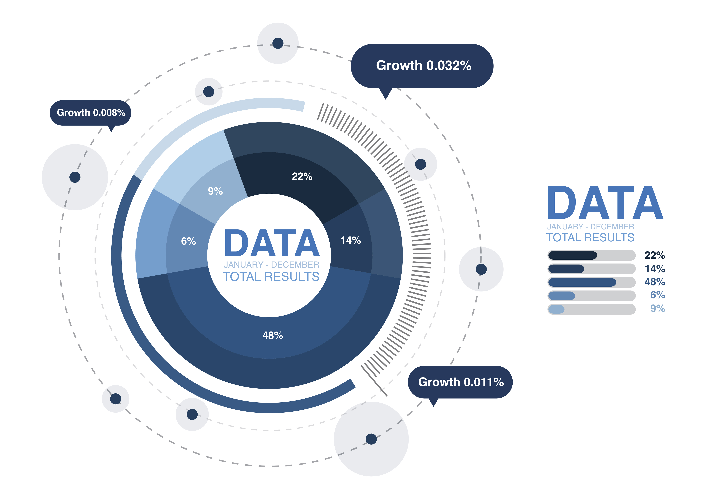
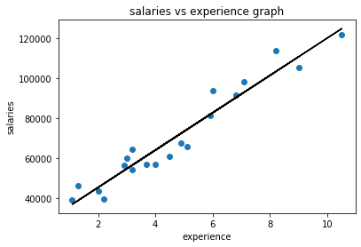

## Introduction
In this article we shall be looking into regression.

Regression is a statistical method that allows us to summarise and study the relationship between two continuous variables/features. For beginner’s continuous variables are variables which values are infinite for example a variable containing the shoe size of different people.

When working with regression the goal is to predict a continuous number for example predicting the price a house will be sold using its location, the condition of the house and so many other variables. 
Regression is one of the two types of supervised learning.
Supervised learning is used when we want to predict a certain outcome from a given input, and we have examples of input/output pairs.

We build a machine learning model from these input/output pairs, which comprise our training set. And our goal is to make accurate predictions for new, never-before-seen data.

## Theory
For regression, the general prediction formula for a linear model looks as follows: ŷ = w[0] * x[0] + w[1] * x[1] + ... + w[n] * x[n] + b

where x[0] to x[n] denotes the features (in this example, the number of features is n)of a single data point, w and b are parameters of the model that are learned, and ŷ is the prediction the model makes. 

For a dataset with a single feature, this is: ŷ = w[0] * x[0] + b
if you examine the above equation you will notice this is the equation of a line from mathematics 
where w[0] is the slope and b is the intercept.

ŷ is called the dependent feature (this is the prediction we want to make for example price of house)
while, x is (w[0] * x[0] + b) and it’s called the independent feature (this is the variable that is used to predict ŷ for example the location of the house).

## Linear Model Examples
### Linear Regression
Linear regression is the simplest and most classic linear method for regression.
Linear regression is a function in the scikit learn Linear model class and makes its predictions using the linear function of the input features

### Ridge regression
Ridge model is also a Linear model for regression, therefore it uses the same formula.
Though, in ridge regression the coefficients (w) are chosen not only so that they predict well on the training data, but also to fit an additional constraint.

We also want the magnitude of coefficients
to be as small as possible; in other words, all values of w should be close to zero. This means each feature should have as little effect on the outcome as possible while still predicting well.
This is Known as Regularization.

Regularization means explicitly restricting a model to avoid overfitting.
Overfitting is when we build a model that is too complex for the amount of information (data) we have. Therefore, the model will not be able to predict well to unseen data.

The type of regularization used in ridge regression is L2 Regularization.

### Lasso Regression 
Lasso regression is also an alternative to ridge regression but it uses L1 Regularization.
The difference of L1 regularization is that when using the lasso, some coefficients are exactly zero. This means some features are entirely ignored by the model. making it a usefull model for feature extraction.

## Conclusion
Regression is but the iceberg in the amounts of methods and models used in supervised learning and machine learning in general. 
i do hope you have learnt something and you will further study machine learning.
